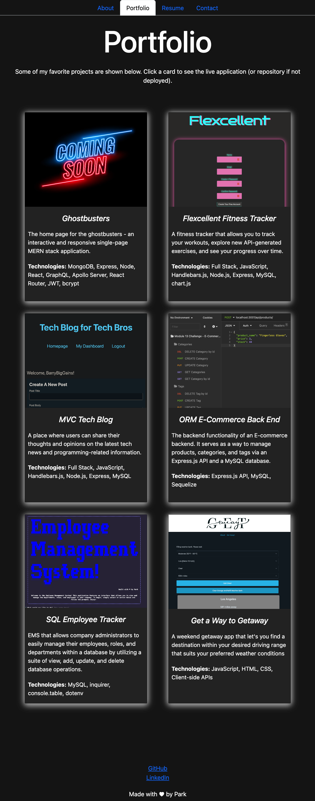

# React Developer Portfolio 

## Description 
A developer portfolio featuring information about me, my favorite projects, my resume, and a form to contact me in addition to links to my GitHub and LinkedIn.

## Table of Contents

* [Installation](#installation)
* [Usage](#usage)
* [Credits](#credits)
* [License](#license)
* [Features](#features)
* [Contributing](#contributing)
* [Tests](#tests)
* [Questions](#questions)

## Screenshot

## Installation 
N/A

## Usage 
Navigate to the deployed application and use the navbar at the top to toggle between the various pages.

## Credits 
N/A

## License
This application is covered under the [MIT](https://opensource.org/licenses/MIT) license.

## Features 
React, Bootstrap

## Contributing 
N/A

## Tests 
N/A

## Questions 
* You can find me on GitHub at [PBodyBrooks](https://github.com/PBodyBrooks). 
* Please do not hesitate to reach out to me via my email: parkerlamarbrook@gmail.com.
